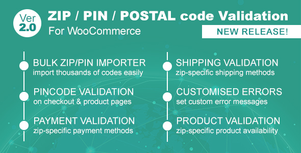

# Intro

This Woo Commerce plugin enables order restriction based on specific zip/post codes. You have to enter list of postcode in given area for which the order restriction works. When activated you will restrict selected gateways or billing address, shipping address and both address at checkout step based on specific zip/post codes.

### Features :

 • Validate Zip/Pin/ Postal Codes at checkout  
 • Sell specific products to specific Zip/Pin/Postal Codes  
 • Zip/Pin/Postal Code based payment gateway  
 • Zip/Pin/Postal Code based shipping method  
 • Built-in CSV importer for bulk importing

