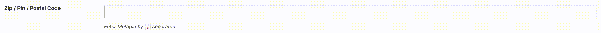
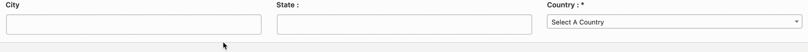
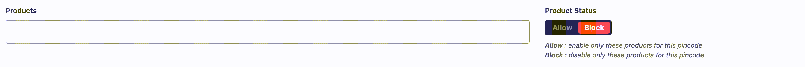
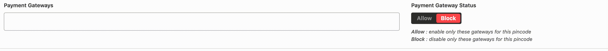
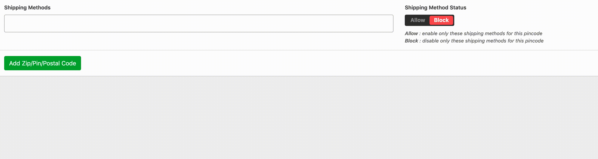
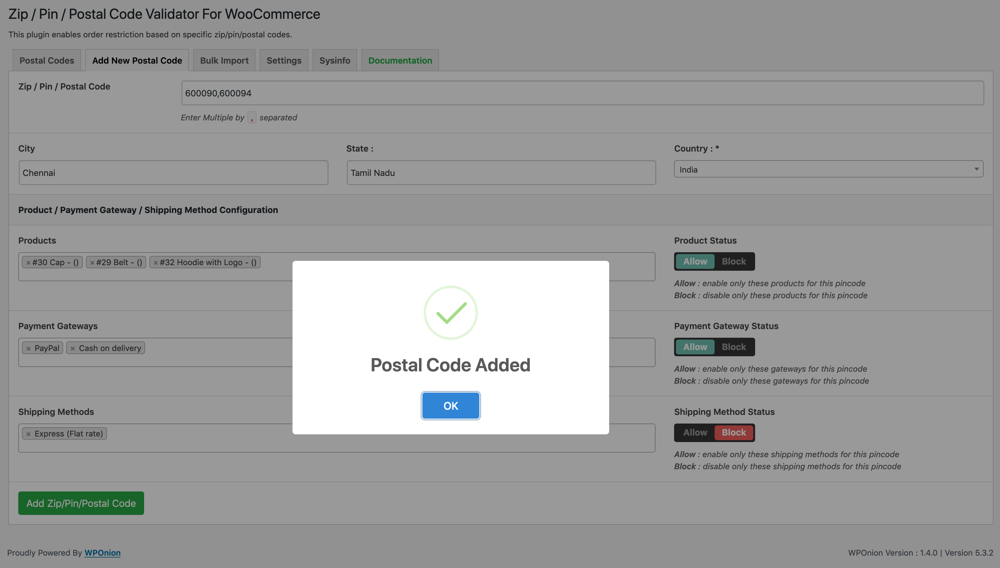

# Add New Postal Code

The first step in the set up of the plugin is adding postal codes. This can be accomplished in two ways -- 

1. Using the **Add New Postal Code** tab, or
2. Using the **Bulk Import** tab

In this section we will discuss the walkthrough of the first method, **Add New Postal Code**, step-by-step.

### Add New Postal Code

Navigate to **WooCommerce** &gt; **Zip/Pin/Postal Code Validator** and click on the **Add New Postal Code** tab.

First, fill the postal code in the **Zip / Pin / Postal Code** field. You can either enter one postal code, or enter multiple codes separated by commas.

Enter the **City**, **State** and select a **Country** from the drop-down list.

The next section enables configuration for **Products**, **Payment Gateways** and **Shipping Methods**.

#### PRODUCTS

You can select products from the list here, which are auto-populated from the store, and choose to either **Allow** or **Block**. 

* If you select **Allow**, only these products are allowed for this postal code.
* If you select **Block**, these products are blocked while other products are allowed.

#### PAYMENT GATEWAYS

You can select from active payment gateways, as activated earlier in the [`WooCommerce  Setup`](woocommerce-setup.md) section, and then choose to either **Allow** these gateways or **Block** them for this postal code.

#### SHIPPING METHODS

You can select from active shipping methods, as created earlier in the [`WooCommerce  Setup`](woocommerce-setup.md) section, and then choose to either **Allow** these methods or **Block** them for this postal code.


#### **Make sure to select shipping methods listed under the "Zone" in which the country you are adding is in.** 

For example, in the demo, India is inside the ****Zone **"Asia"**, so we selected shipping methods under Asia.


**Finally, click the `Add Zip/Pin/Postal Code` button to save this postal code.**

**That's it, you're all set!** Now add as many postal codes as you require. 

If you have a lot more codes, you can always choose to run the [**`Bulk Import`**](bulk-import.md) as demonstrated in the next section. 

