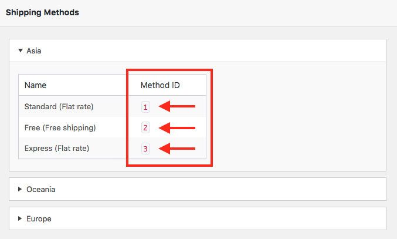
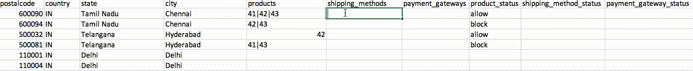
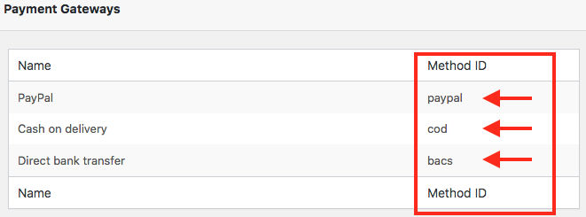
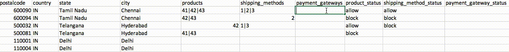
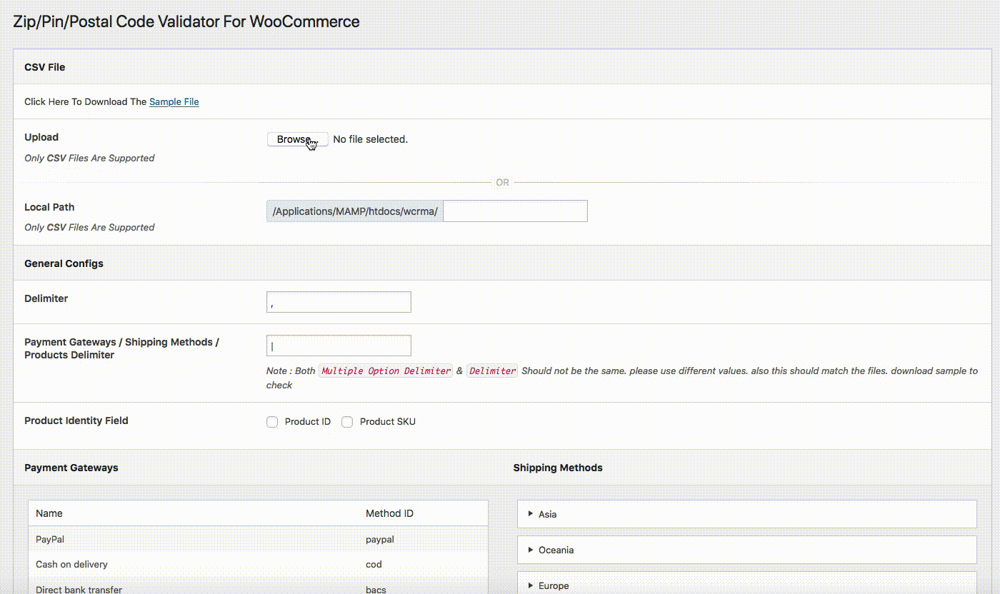
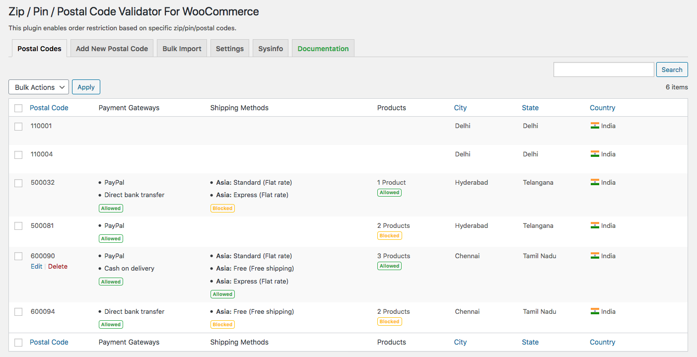

# Bulk Import

The [**`Add New Postal Code`**](add-postal-code.md) ****method works best for adding limited number of postal codes, or to perform incremental updates, or modify existing pincodes. However, if you have a large number of postal codes, the best way to move forward is to use the **Bulk Import**. 

The **Bulk Import** steps are demonstrated in this section.

First, open the **Bulk Import** tab and download the _Sample File_

Once the _CSV sample file_ is downloaded, you can populate the fields as demonstrated below.


**Do not change the first row of the CSV file.** Changing this can cause import errors.


As the first step, add **postal code**, **country**, **state** and **city**, one per line.

#### **PRODUCTS**

The **products** column permits you to either **allow** or **block** specific products for this postal code. If you would like to allow all products for this postal code, leave the column empty.

To **allow** specific products for a postal code enter **Product IDs** separated by the pipe delimiter "\|" in the **products** column, and in the **product\_status** column, enter **allow**. To **block** them, enter **block** in the **product\_status** column. Alternately, you can also use **SKUs** instead of **Product IDs**.

#### SHIPPING METHODS

The **shipping\_methods** column permits you to either **allow** or **block** specific shipping methods for this postal code. If you would like to allow all methods for this postal code, leave the column empty.

To **allow** specific methods for a postal code enter the **Method IDs** separated by the pipe delimiter "\|" in the **shipping\_methods** column, and in the **shipping\_method\_status** column, enter **allow**. To **block** them, enter **block** in the **shipping\_method\_status** column.


You can find **Method IDs** listed under the _**Shipping Methods**_ section of the import page


#### PAYMENT GATEWAYS

The **payment\_gateways** column permits you to either **allow** or **block** specific payment gateways for this postal code. If you would like to allow all gateways for this postal code, leave the column empty.

To **allow** specific methods for a postal code enter the **Method IDs** separated by the pipe delimiter "\|" in the **payment\_gateways** column, and in the **payment\_gateway\_status** column, enter **allow**. To **block** them, enter **block** in the **payment\_gateway\_status** column.


You can find **Method IDs** listed under the _**Payment Gateways**_ section of the import page


The bulk import file is now complete. The final step in this process is to import it into the plugin. Click **Browse** at the top of the import page, select the CSV file, and click the **Upload File & Import** button at the bottom.


**Please be patient!** Depending on the number of postal codes in the file, it could take up to a few minutes to process.


**That's it! You're all done.** To make sure the import was successful, navigate to: WooCommerce &gt; Zip/Pin/Postal Code Validator. You should see all the imported postal codes listed under the **Postal Codes** tab.

