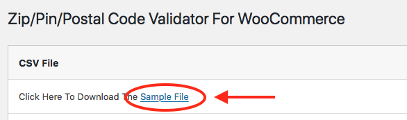
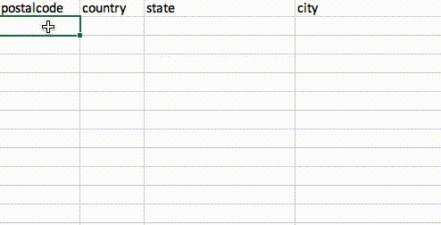
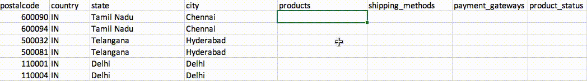

# Bulk Import

The [**`Add New Postal Code`**](add-postal-code.md) ****method works best for adding limited number of postal codes, or to perform incremental updates, or modify existing pincodes. However, if you have a large number of postal codes, the best way to move forward is to use the **Bulk Import**. 

The **Bulk Import** steps are demonstrated in this section.

First, open the **Bulk Import** tab and download the _Sample File_

Once the _CSV sample file_ is downloaded, you can populate the fields as demonstrated below.


**Do not change the first row of the CSV file.** Changing this can cause import errors.


As the first step, add **postal code**, **country**, **state** and **city**, one per line.

#### **PRODUCTS**

The **products** column permits you to either **allow** or **block** specific products for this postal code. If you would like to allow all products for this postal code, leave the products column empty.

To **allow** specific products for a postal code enter **Product IDs** separated by the pipe delimiter "\|" in the **products** column, and in the **product\_status** column, enter **allow**. To **block** them, enter **block** in the **product\_status** column. Alternately, you can also use **SKUs** instead of **Product IDs**.

PRODUCTS

SHIPPING METHODS

PAYMENT GATEWAYS

PRODUCT STATUS

SHIPPING METHOD STATUS

PAYMENT GATEWAY STATUS

