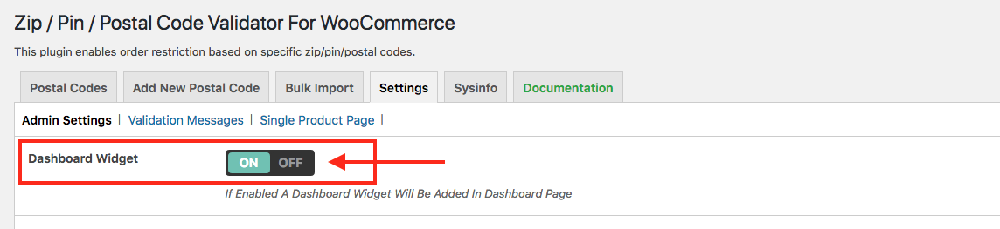
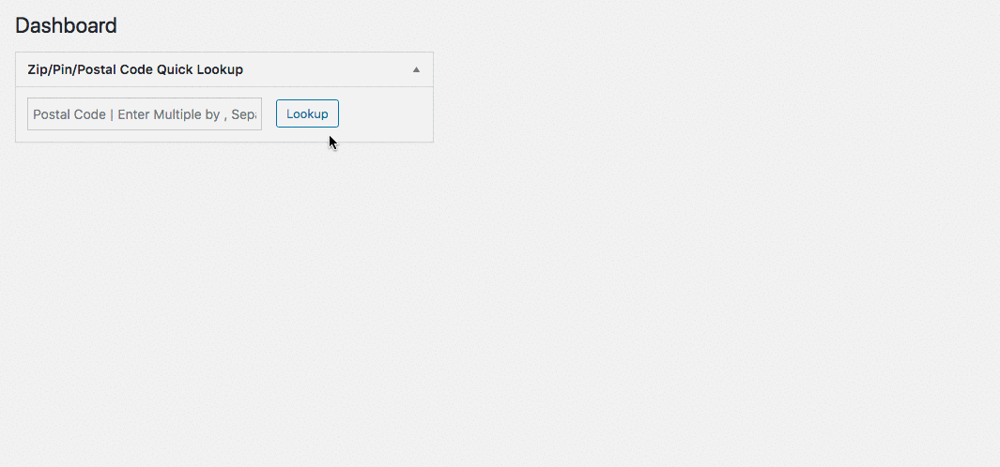
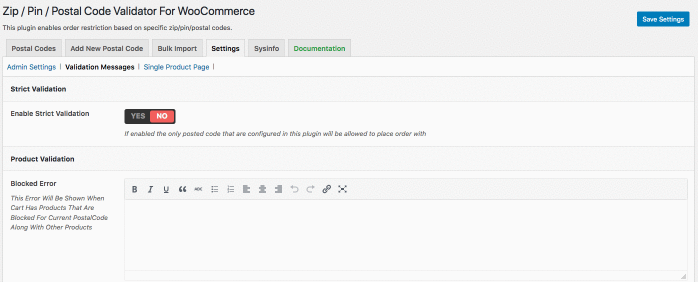
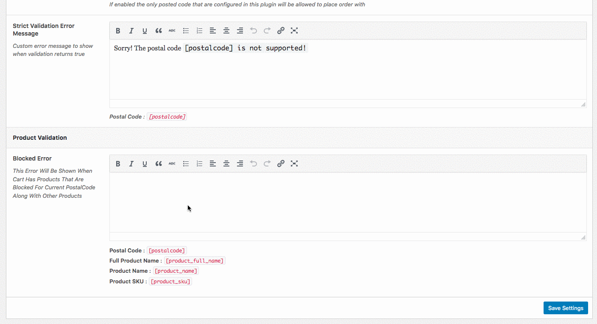

# Settings

The **Settings** section handles the configuration of the plugin. The configurable options available are:

* Admin Settings, 
* Validation Messages, and 
* Single Product Page

Each of these are explained in detail as under.

### ADMIN SETTINGS

This section provides an option to turn on/off the **dashboard widget**. This setting adds a widget to the admin dashboard to quickly get information regarding any postal code in the database.

### VALIDATION MESSAGES

This section allows you to enter custom validation messages that the user of your website sees when they enter an unsupported postal code, or when a product is not available at the selected postal code.

#### STRICT VALIDATION

To allow the users of your website to place orders only to the postal codes available in the database, turn on the strict validation. If this validation is turned off, users can place orders to any postal code.

#### PRODUCT VALIDATION

The validation message entered here is shown to the user when the products being purchased are not available at the selected postal code.

