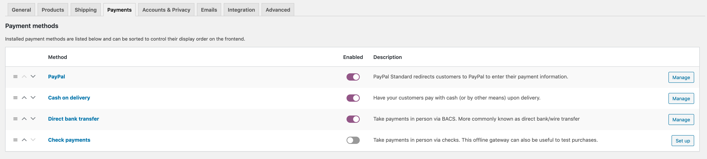
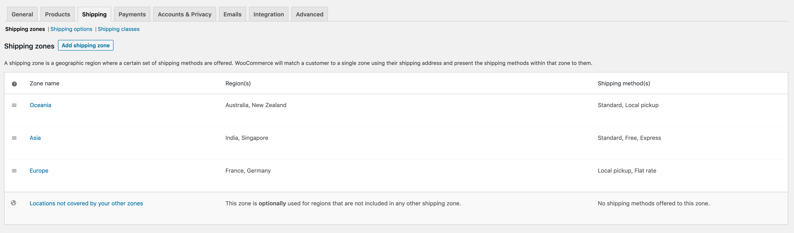

# WooCommerce Setup

### WooCommerce

Since this plugin requires WooCommerce, the first step would be to install and setup WooCommerce. Two primary aspects of WooCommerce that this plugin relies on are **Payment** and **Shipping**. For instructions on how to configure them, please refer to the WooCommerce [`documentation`](https://docs.woocommerce.com/).

For the purposes of this documentation, we have our setup of these two configured as below:

### Payment

We have setup the following payment gateways in our current installation:

1. **BACS** \(WooCommerce built-in gateway\)
2. **Cash on Delivery** \(WooCommerce built-in gateway\)
3. **PayPal** \(Pre-packaged with WooCommerce\)

Below is a screenshot of what the **Payments** tab looks like in the WooCommerce settings:

### Shipping

We have setup three shipping zones, one each for **Asia**, **Europe** and **Oceania \(Australia\)**, and two countries in each of the zones. We have used a different permutation and combination of shipping methods in each zone to better illustrate the capabilities of the plugin.

Below is a screenshot of what the **Shipping** tab looks like in the WooCommerce settings:

**We have completed the basic WooCommerce setup required for this plugin, and can now move on to the next steps.**

